# 📊 Tinder AI Platform - Візуальна IR Діаграма

## 🗄️ Database Schema & Relations


---

## 🔄 Content Generation Flow

```mermaid
sequenceDiagram
    participant User
    participant Frontend
    participant Backend
    participant OpenAI
    participant Replicate
    participant Database
    
    User->>Frontend: Вводить промпт
    Frontend->>Backend: POST /api/content/generate
    
    rect rgb(200, 220, 255)
        Note over Backend,OpenAI: 1. Category Detection
        Backend->>OpenAI: detectCategory(prompt)
        OpenAI-->>Backend: category="dating"
    end
    
    rect rgb(255, 220, 200)
        Note over Backend,Database: 2. Fetch User Insights
        Backend->>Database: getUserInsights(userId)
        Database-->>Backend: {likes: [], dislikes: []}
    end
    
    rect rgb(200, 255, 220)
        Note over Backend,OpenAI: 3. Enhance Prompt
        Backend->>OpenAI: enhancePrompt(prompt, insights)
        OpenAI-->>Backend: enhancedPrompt
    end
    
    rect rgb(255, 255, 200)
        Note over Backend,Replicate: 4. Generate Content
        Backend->>Replicate: generateImage(enhancedPrompt)
        Note over Replicate: ~30-60 секунд
        Replicate-->>Backend: imageURL
    end
    
    rect rgb(220, 200, 255)
        Note over Backend,Database: 5. Save to DB
        Backend->>Database: INSERT INTO content
        Database-->>Backend: contentId
    end
    
    Backend-->>Frontend: {content: {...}}
    Frontend-->>User: Показує фото
```



---

## 🔄 Rating & Insights Update Flow


---

## 🏗️ System Architecture


---

## 📡 API Endpoints Map

```mermaid
graph LR
    API[/api] --> Health[/health<br/>GET]
    
    API --> Auth[/auth]
    Auth --> Register[/register<br/>POST]
    Auth --> Login[/login<br/>POST]
    Auth --> Me[/me<br/>GET]
    
    API --> Content[/content]
    Content --> Generate[/generate<br/>POST]
    Content --> GetContent[/:id<br/>GET]
    Content --> ListContent[/<br/>GET]
    Content --> Random[/random/next<br/>GET]
    
    API --> Ratings[/ratings]
    Ratings --> CreateRating[/<br/>POST]
    Ratings --> ListRatings[/<br/>GET]
    Ratings --> Stats[/stats<br/>GET]
    
    API --> Insights[/insights]
    Insights --> UserInsights[/user/:userId<br/>GET]
    Insights --> UpdateUser[/user/:userId/update<br/>POST]
    Insights --> TemplateInsights[/template/:id<br/>GET]
    Insights --> Dashboard[/dashboard<br/>GET]
    
    API --> Admin[/admin]
    Admin --> Templates[/templates<br/>GET/POST]
    Admin --> TemplateById[/templates/:id<br/>GET/PUT/DELETE]
    
    style API fill:#1976d2,color:#fff
    style Auth fill:#f57c00,color:#fff
    style Content fill:#388e3c,color:#fff
    style Ratings fill:#7b1fa2,color:#fff
    style Insights fill:#c62828,color:#fff
    style Admin fill:#455a64,color:#fff
```

---

## 🔄 Data Flow: Prompt Enhancement with Insights

```mermaid
graph TB
    Start([User Prompt]) --> Category{Category<br/>Detection}
    
    Category -->|dating| Dating[Dating System Prompt]
    Category -->|other| General[General System Prompt]
    
    Dating --> Insights{User has<br/>insights?}
    General --> Insights
    
    Insights -->|Yes| Fetch[Fetch user_insights]
    Insights -->|No| NoInsights[Use template insights only]
    
    Fetch --> Likes[likes_json:<br/>посмішка, волося, поза]
    Fetch --> Dislikes[dislikes_json:<br/>рижих, лінзи]
    
    Likes --> Merge[Merge with template insights]
    Dislikes --> Merge
    NoInsights --> Merge
    
    Merge --> Build[Build Context]
    Build --> Enhance[OpenAI enhancePrompt]
    
    Enhance --> Output[Enhanced Prompt:<br/>Young woman, brunette hair,<br/>natural smile, beach...]
    
    Output --> Generate[Replicate generateImage]
    Generate --> Result([Generated Image])
    
    style Start fill:#90caf9
    style Insights fill:#ffb74d
    style Likes fill:#81c784
    style Dislikes fill:#e57373
    style Enhance fill:#ba68c8
    style Result fill:#4db6ac
```



---

## ⚠️ Current Problem: Comment-Only Insights

```mermaid
graph LR
    subgraph All_Ratings["👤 User Ratings (36 total)"]
        R1[Rating 1<br/>✅ comment]
        R2[Rating 2<br/>❌ no comment]
        R3[Rating 3<br/>✅ comment]
        R4[Rating 4<br/>❌ no comment]
        R5[Rating 5<br/>❌ no comment]
        More[... 31 more]
    end
    
    subgraph Filter["🔍 Filter Process"]
        OnlyComments[".filter(r => r.comment)"]
    end
    
    subgraph Analyzed["📊 Analyzed (11 only)"]
        C1[Comment 1]
        C2[Comment 2]
        C3[Comment 3]
        More2[... 8 more]
    end
    
    subgraph Lost["❌ Lost Data (25)"]
        L1[Silent like]
        L2[Silent like]
        L3[Silent dislike]
        More3[... 22 more]
    end
    
    R1 --> OnlyComments
    R2 -.X.-> Lost
    R3 --> OnlyComments
    R4 -.X.-> Lost
    R5 -.X.-> Lost
    
    OnlyComments --> C1
    OnlyComments --> C2
    OnlyComments --> C3
    
    C1 --> OpenAI[OpenAI Analysis]
    C2 --> OpenAI
    C3 --> OpenAI
    
    OpenAI --> Insights[(user_insights<br/>Based on 30% data!)]
    
    style Filter fill:#ff6b6b,color:#fff
    style Lost fill:#757575,color:#fff
    style Analyzed fill:#4caf50,color:#fff
    style Insights fill:#ff9800,color:#fff
```



---

## 💡 Proposed Solution: Hybrid Approach


---

## 📊 Performance & Cost

```mermaid
graph LR
    subgraph Generation["🎨 Content Generation"]
        G1[Category: 1.2s<br/>$0.0001]
        G2[Enhancement: 3.6s<br/>$0.003]
        G3[AI Gen: 40s<br/>$0.03]
        Total1[Total: 45s<br/>$0.033]
        
        G1 --> G2 --> G3 --> Total1
    end
    
    subgraph Rating["⭐ Rating Submit"]
        R1[Validation: 0.05s]
        R2[Save: 0.15s]
        R3[Trigger: 0.1s]
        Total2[Total: 0.3s<br/>Free]
        
        R1 --> R2 --> R3 --> Total2
    end
    
    subgraph Insights["🧠 Insights Update"]
        I1[Fetch: 0.2s]
        I2[OpenAI x2: 4s<br/>$0.0006]
        I3[Save: 0.15s]
        Total3[Total: 4.5s<br/>$0.0006]
        
        I1 --> I2 --> I3 --> Total3
    end
    
    style Total1 fill:#e57373,color:#fff
    style Total2 fill:#81c784,color:#fff
    style Total3 fill:#64b5f6,color:#fff
```



---

## 🔐 Authentication Flow


---

## 🚀 Deployment Architecture

```mermaid
graph TB
    subgraph GitHub["📦 GitHub Repository"]
        Code[Source Code]
        Actions[GitHub Actions]
    end
    
    subgraph Vercel["☁️ Vercel Platform"]
        Build[Build Process]
        
        subgraph Frontend_Deploy["Frontend"]
            Static[Static Files<br/>React Build]
            CDN_V[Vercel CDN]
        end
        
        subgraph Backend_Deploy["Backend"]
            Lambda[Serverless Functions<br/>AWS Lambda]
            API_Route[/api/* routes]
        end
        
        Blob[Blob Storage]
    end
    
    subgraph External["🌐 External Services"]
        Supabase[(Supabase<br/>PostgreSQL)]
        OpenAI_API[OpenAI API]
        Replicate_API[Replicate API]
        Replicate_CDN[Replicate CDN]
    end
    
    Code --> Actions
    Actions --> Build
    
    Build --> Static
    Build --> Lambda
    
    Static --> CDN_V
    Lambda --> API_Route
    
    API_Route <--> Supabase
    API_Route <--> OpenAI_API
    API_Route <--> Replicate_API
    API_Route --> Blob
    
    Replicate_API --> Replicate_CDN
    
    Users[👥 Users] --> CDN_V
    Users --> API_Route
    
    style GitHub fill:#24292e,color:#fff
    style Vercel fill:#000,color:#fff
    style External fill:#1976d2,color:#fff
```

---

## 📈 Insights Accumulation Over Time


---

## 🎯 Key Metrics Dashboard


---

## 🔧 Technologies Stack


---

## 📝 Quick Reference

### Timing
- **Generation**: 35-40 seconds
- **Rating**: 0.3 seconds  
- **Insights Update**: 4.5 seconds

### Cost per 1000 Generations
- **OpenAI**: $3.29
- **Replicate**: $30.00
- **Storage**: $0.30
- **Total**: ~$33.60

### Key Problem
⚠️ **Only 30% of ratings analyzed** (those with comments)

### Recommended Solution
🎯 **Hybrid Approach**: Comments (priority) + Vision API (top-10 fallback)

---

**Version:** 1.0  
**Date:** 2025-11-21  
**Format:** Mermaid Diagrams (render on GitHub or use Mermaid viewer)

