# 🏗️ Architecture - Tinder AI Platform

**Database Schema, System Architecture, and Data Flow**

---

## 📊 Database Schema (ER Diagram)

### Entity Relationship Diagram


---

## 🗄️ Tables Detail

### 1. USERS
**Purpose:** User accounts and authentication

| Column | Type | Description |
|--------|------|-------------|
| id | UUID | Primary Key |
| username | VARCHAR(UK) | Unique login |
| email | VARCHAR(UK) | Email address |
| password_hash | VARCHAR | bcrypt hash |
| role | ENUM | 'user' \| 'admin' |
| is_active | BOOLEAN | Account status |
| created_at | TIMESTAMP | Registration date |

**Indexes:**
- `idx_users_username`
- `idx_users_email`

---

### 2. PROMPT_TEMPLATES
**Purpose:** AI prompt templates with learned insights

| Column | Type | Description |
|--------|------|-------------|
| id | UUID | Primary Key |
| name | VARCHAR(UK) | Template name |
| category | VARCHAR | dating/nature/etc |
| base_prompt | TEXT | Base template |
| system_instructions | TEXT | OpenAI system prompt |
| insights_json | JSONB | {likes: [], dislikes: []} |
| total_uses | INTEGER | Usage count |
| avg_like_rate | FLOAT | Average rating |

**Indexes:**
- `idx_prompt_templates_name`
- `idx_prompt_templates_active`

---

### 3. CONTENT
**Purpose:** Generated AI content

| Column | Type | Description |
|--------|------|-------------|
| id | UUID | Primary Key |
| template_id | UUID(FK) | Template used |
| user_id | UUID(FK) | Creator |
| parent_id | UUID(FK) | Parent (variations) |
| url | TEXT(UK) | Content URL |
| media_type | VARCHAR | image/video/audio |
| original_prompt | TEXT | User input |
| enhanced_prompt | TEXT | OpenAI enhanced |
| final_prompt | TEXT | Used for generation |
| model | VARCHAR | AI model used |
| likes_count | INTEGER | Auto-updated |
| like_rate | FLOAT | Auto-calculated |

**Indexes:**
- `idx_content_created`
- `idx_content_user`
- `idx_content_like_rate`

**Triggers:**
- `update_content_stats` - Auto-update stats after rating

---

### 4. RATINGS
**Purpose:** User feedback on content

| Column | Type | Description |
|--------|------|-------------|
| id | UUID | Primary Key |
| content_id | UUID(FK) | Rated content |
| user_id | UUID(FK) | Who rated |
| direction | ENUM | left/right/up/down |
| comment | TEXT | Optional feedback |
| latency_ms | INTEGER | Reaction time |
| created_at | TIMESTAMP | When rated |

**Direction Values:**
- `left` - Dislike
- `right` - Like
- `up` - Superlike
- `down` - Skip (can re-rate)

**Indexes:**
- `idx_ratings_content`
- `idx_ratings_user`
- `idx_ratings_user_content_unique` (UNIQUE)

---

### 5. USER_INSIGHTS
**Purpose:** Learned user preferences

| Column | Type | Description |
|--------|------|-------------|
| user_id | UUID(PK) | User reference |
| likes_json | JSONB | [{keyword, count}] |
| dislikes_json | JSONB | [{keyword, count}] |
| preferences_json | JSONB | {suggestions: []} |
| total_swipes | INTEGER | All ratings |
| total_likes | INTEGER | Likes count |
| total_dislikes | INTEGER | Dislikes count |
| updated_at | TIMESTAMP | Last update |

**Likes/Dislikes Format:**
```json
[
  {"keyword": "гарна посмішка", "count": 3},
  {"keyword": "натуральне освітлення", "count": 2}
]
```

**Update Trigger:** Every 10 ratings

---

## 🔗 Relationships

### 1. USERS → CONTENT (1:N)
```
users.id ←─ content.user_id
ON DELETE: SET NULL
```

### 2. USERS → RATINGS (1:N)
```
users.id ←─ ratings.user_id
REQUIRED: NOT NULL
```

### 3. USERS → USER_INSIGHTS (1:1)
```
users.id ←─ user_insights.user_id
ON DELETE: CASCADE
```

### 4. PROMPT_TEMPLATES → CONTENT (1:N)
```
prompt_templates.id ←─ content.template_id
ON DELETE: SET NULL
```

### 5. CONTENT → RATINGS (1:N)
```
content.id ←─ ratings.content_id
ON DELETE: CASCADE
```

### 6. CONTENT → CONTENT (1:N) Self-Reference
```
content.id ←─ content.parent_id
Used for: Variations of same content
```

---

## 🔄 Data Flow Diagrams

### Content Generation Flow


---

### Rating & Insights Update Flow


---

## 🏗️ System Architecture

```mermaid
graph TB
    subgraph Frontend["🌐 FRONTEND"]
        UI[React UI]
        Router[React Router]
        API_Client[Axios Client]
    end
    
    subgraph Backend["⚙️ BACKEND"]
        Express[Express Server]
        Routes[API Routes]
        Services[Business Logic]
    end
    
    subgraph Database["🗄️ DATABASE"]
        Supabase[(Supabase PostgreSQL)]
        Storage[Supabase Storage]
    end
    
    subgraph AI["🧠 AI SERVICES"]
        OpenAI[OpenAI GPT-4o/mini]
        Replicate[Replicate Seedream-4]
    end
    
    UI --> Router
    Router --> API_Client
    API_Client <-->|HTTP REST| Express
    Express --> Routes
    Routes --> Services
    
    Services <--> Supabase
    Services <--> Storage
    Services <--> OpenAI
    Services <--> Replicate
    
    style Frontend fill:#e3f2fd
    style Backend fill:#fff3e0
    style Database fill:#f3e5f5
    style AI fill:#e8f5e9
```



---

## ⚙️ Database Triggers

### 1. update_content_stats
**When:** AFTER INSERT ON ratings  
**Action:** Auto-update content statistics

```sql
UPDATE content SET
  total_ratings = COUNT(*),
  likes_count = COUNT(*) WHERE direction='right',
  dislikes_count = COUNT(*) WHERE direction='left',
  like_rate = (likes + superlikes) / total_ratings
WHERE id = NEW.content_id;
```

### 2. update_updated_at_column
**When:** BEFORE UPDATE ON prompt_templates, user_insights  
**Action:** Auto-set updated_at = NOW()

---

## 📈 Insights Analysis Process

### Current Implementation

⚠️ **ONLY analyzes ratings with comments!**

```
36 total ratings
├─ 11 with comments → ✅ Analyzed by OpenAI
└─ 25 without comments → ❌ Ignored (70% data loss!)
```

### Process:

1. **Fetch Ratings** - Last 50 ratings
2. **Filter** - `ratings.filter(r => r.comment)` ⚠️
3. **Separate** - likes vs dislikes
4. **OpenAI Analysis** - Extract keywords
5. **Count Frequency** - {keyword, count}
6. **Upsert** - Update user_insights

### Potential Solutions:

**Option A:** Keep as-is (quality over quantity)  
**Option B:** Add Vision API for non-commented ratings  
**Option C:** Hybrid (comments priority + Vision fallback)

---

## 🎯 API Endpoints Map

```mermaid
graph LR
    API[/api]
    
    API --> Content[/content]
    Content --> Generate[/generate POST]
    Content --> GetID[/:id GET]
    Content --> Random[/random/next GET]
    
    API --> Ratings[/ratings]
    Ratings --> CreateRating[/ POST]
    Ratings --> Stats[/stats GET]
    
    API --> Insights[/insights]
    Insights --> UserInsights[/user/:userId GET]
    Insights --> UpdateInsights[/user/:userId/update POST]
    Insights --> Dashboard[/dashboard GET]
    
    API --> Auth[/auth]
    Auth --> Register[/register POST]
    Auth --> Login[/login POST]
    
    style API fill:#1976d2,color:#fff
    style Content fill:#388e3c,color:#fff
    style Ratings fill:#7b1fa2,color:#fff
    style Insights fill:#c62828,color:#fff
    style Auth fill:#f57c00,color:#fff
```

---

## 📊 Performance Metrics

### Database Sizes (Estimated for 10K users)

| Table | Records | Size/Record | Total |
|-------|---------|-------------|-------|
| users | 10,000 | ~500 bytes | ~5 MB |
| prompt_templates | 50 | ~2 KB | ~100 KB |
| content | 100,000 | ~1 KB | ~100 MB |
| ratings | 500,000 | ~300 bytes | ~150 MB |
| user_insights | 10,000 | ~2 KB | ~20 MB |
| **TOTAL** | | | **~275 MB** |

### Timing Metrics

| Operation | Duration |
|-----------|----------|
| Category Detection | ~1.2 sec |
| User Insights Fetch | ~0.1 sec |
| Prompt Enhancement | ~3.6 sec |
| AI Generation | ~40 sec |
| Database Save | ~0.2 sec |
| **Total Generation** | **~45 sec** |
| **Rating Submit** | **~0.3 sec** |
| **Insights Update** | **~4.5 sec** |

---

## 💰 Cost Breakdown (per 1000 generations)

| Service | Usage | Cost |
|---------|-------|------|
| OpenAI Category | 1000 × 20 tokens | $0.03 |
| OpenAI Enhancement | 1000 × 650 tokens | $3.25 |
| OpenAI Comments | 100 × 400 tokens | $0.01 |
| Replicate Images | 1000 × $0.03 | $30.00 |
| Supabase Storage | 1000 × 2MB | $0.30 |
| **TOTAL** | | **~$33.60** |
| **Per Image** | | **~$0.034** |

---

## 🔐 Security & Constraints

### Primary Keys
- All tables use UUID (uuid_generate_v4())

### Foreign Keys
- CASCADE DELETE: user_insights, ratings
- SET NULL: content.user_id, content.template_id

### Unique Constraints
- users.username, users.email
- prompt_templates.name
- content.url
- ratings(user_id, content_id)

### Check Constraints
- users.role IN ('user', 'admin')
- content.media_type IN ('image', 'video', 'audio', 'text')
- ratings.direction IN ('left', 'right', 'up', 'down')

---

## 🔧 Optimization

### Indexes
- ✅ All FKs indexed
- ✅ Unique constraints indexed
- ✅ Frequently queried columns indexed

### Denormalization
Content table caches:
- `total_ratings` (instead of COUNT)
- `likes_count` (instead of COUNT WHERE)
- `like_rate` (auto-calculated)

**Benefits:** Fast queries without JOINs  
**Cost:** Trigger overhead on INSERT

### Future Optimizations
- Partitioning ratings by date (monthly)
- Redis cache for user_insights
- Archive old ratings (>1 year)

---

## 📝 SQL Examples

### Get User Insights
```sql
SELECT 
  ui.likes_json,
  ui.dislikes_json,
  ui.total_swipes,
  ui.total_likes,
  ui.total_dislikes
FROM user_insights ui
WHERE ui.user_id = $1;
```

### Top Content by User
```sql
SELECT c.*, r.direction as user_rating
FROM content c
LEFT JOIN ratings r 
  ON c.id = r.content_id 
  AND r.user_id = $1
WHERE c.user_id = $1
ORDER BY c.like_rate DESC, c.created_at DESC
LIMIT 10;
```

### Random Unrated Content
```sql
SELECT c.*
FROM content c
WHERE c.id NOT IN (
  SELECT content_id 
  FROM ratings 
  WHERE user_id = $1 
  AND direction != 'down'
)
ORDER BY created_at DESC
LIMIT 1;
```

---

## ✅ Summary

### Database:
- ✅ 5 normalized tables (3NF)
- ✅ Foreign keys with proper constraints
- ✅ Auto-update triggers
- ✅ Optimized indexes

### Architecture:
- ✅ React Frontend
- ✅ Express Backend
- ✅ Supabase PostgreSQL
- ✅ OpenAI + Replicate integration
- ✅ Vercel deployment ready

### Performance:
- ✅ ~45 sec generation time
- ✅ ~0.3 sec rating time
- ✅ ~$0.034 per image
- ✅ Scales to 10K+ users

---

**Version:** 1.0  
**Last Updated:** 2025-11-21  
**Status:** ✅ Production Ready
