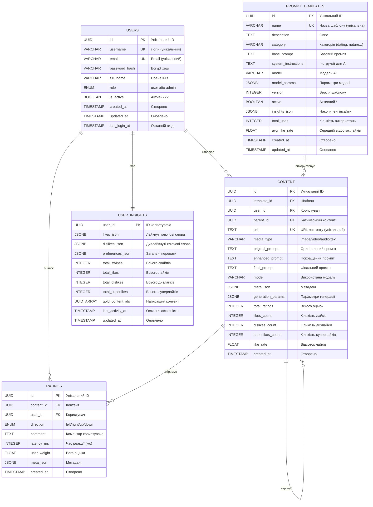

# 🗄️ ER-Діаграма База Даних - Tinder AI Platform

## 📊 Entity Relationship Diagram



---

## 📋 Детальний Опис Сутностей

### 1️⃣ USERS (Користувачі)
**Призначення:** Зберігає дані користувачів системи

| Поле | Тип | Опис | Обмеження |
|------|-----|------|-----------|
| id | UUID | Унікальний ідентифікатор | PRIMARY KEY |
| username | VARCHAR | Логін користувача | UNIQUE, NOT NULL |
| email | VARCHAR | Email адреса | UNIQUE, NOT NULL |
| password_hash | VARCHAR | Хеш пароля (bcrypt) | NOT NULL |
| full_name | VARCHAR | Повне ім'я | |
| role | ENUM | Роль: 'user' або 'admin' | NOT NULL, DEFAULT 'user' |
| is_active | BOOLEAN | Активний акаунт | DEFAULT true |
| created_at | TIMESTAMP | Дата створення | DEFAULT NOW() |
| updated_at | TIMESTAMP | Дата оновлення | AUTO UPDATE |
| last_login_at | TIMESTAMP | Останній вхід | |

**Індекси:**
- `idx_users_username` - швидкий пошук за логіном
- `idx_users_email` - швидкий пошук за email
- `idx_users_role` - фільтрація за ролями

---

### 2️⃣ PROMPT_TEMPLATES (Шаблони Промптів)
**Призначення:** Зберігає шаблони для генерації контенту

| Поле | Тип | Опис | Обмеження |
|------|-----|------|-----------|
| id | UUID | Унікальний ідентифікатор | PRIMARY KEY |
| name | VARCHAR | Назва шаблону | UNIQUE, NOT NULL |
| description | TEXT | Опис шаблону | |
| category | VARCHAR | Категорія (dating, nature...) | |
| base_prompt | TEXT | Базовий промпт | NOT NULL |
| system_instructions | TEXT | Інструкції для OpenAI | |
| model | VARCHAR | AI модель за замовчуванням | NOT NULL |
| model_params | JSONB | Параметри моделі | DEFAULT '{}' |
| version | INTEGER | Версія шаблону | DEFAULT 1 |
| active | BOOLEAN | Чи активний шаблон | DEFAULT true |
| insights_json | JSONB | Накопичені insights | DEFAULT '{"likes":[],"dislikes":[]}' |
| total_uses | INTEGER | Кількість використань | DEFAULT 0 |
| avg_like_rate | FLOAT | Середній % лайків | DEFAULT 0.0 |
| created_at | TIMESTAMP | Дата створення | DEFAULT NOW() |
| updated_at | TIMESTAMP | Дата оновлення | AUTO UPDATE |

**Індекси:**
- `idx_prompt_templates_name` - пошук за назвою
- `idx_prompt_templates_active` - фільтр активних
- `idx_prompt_templates_category` - фільтр за категорією

---

### 3️⃣ CONTENT (Згенерований Контент)
**Призначення:** Зберігає згенерований AI контент

| Поле | Тип | Опис | Обмеження |
|------|-----|------|-----------|
| id | UUID | Унікальний ідентифікатор | PRIMARY KEY |
| template_id | UUID | Зв'язок з шаблоном | FK → prompt_templates(id), SET NULL |
| user_id | UUID | Хто створив | FK → users(id), SET NULL |
| parent_id | UUID | Батьківський контент | FK → content(id), SET NULL |
| url | TEXT | URL контенту | UNIQUE, NOT NULL |
| media_type | VARCHAR | Тип медіа | CHECK IN ('image','video','audio','text') |
| original_prompt | TEXT | Оригінальний промпт | NOT NULL |
| enhanced_prompt | TEXT | Покращений OpenAI | |
| final_prompt | TEXT | Фінальний використаний | |
| model | VARCHAR | Використана модель | NOT NULL |
| meta_json | JSONB | Метадані | DEFAULT '{}' |
| generation_params | JSONB | Параметри генерації | DEFAULT '{}' |
| total_ratings | INTEGER | Всього оцінок | DEFAULT 0, AUTO UPDATE |
| likes_count | INTEGER | Кількість лайків | DEFAULT 0, AUTO UPDATE |
| dislikes_count | INTEGER | Кількість дизлайків | DEFAULT 0, AUTO UPDATE |
| superlikes_count | INTEGER | Кількість суперлайків | DEFAULT 0, AUTO UPDATE |
| like_rate | FLOAT | % лайків | DEFAULT 0.0, AUTO CALCULATE |
| created_at | TIMESTAMP | Дата створення | DEFAULT NOW() |

**Індекси:**
- `idx_content_created` - сортування за датою
- `idx_content_user` - контент користувача
- `idx_content_template` - контент шаблону
- `idx_content_like_rate` - найкращий контент
- `idx_content_url_unique` - унікальність URL
- `idx_content_media_type` - фільтр за типом

**Тригери:**
- `update_content_stats()` - автоматичне оновлення статистики після rating

---

### 4️⃣ RATINGS (Оцінки)
**Призначення:** Зберігає оцінки користувачів

| Поле | Тип | Опис | Обмеження |
|------|-----|------|-----------|
| id | UUID | Унікальний ідентифікатор | PRIMARY KEY |
| content_id | UUID | Оцінений контент | FK → content(id), CASCADE DELETE |
| user_id | UUID | Хто оцінив | FK → users(id), NOT NULL |
| direction | ENUM | Напрямок свайпу | CHECK IN ('left','right','up','down') |
| comment | TEXT | Коментар користувача | NULLABLE |
| latency_ms | INTEGER | Час реакції (мс) | |
| user_weight | FLOAT | Вага оцінки | DEFAULT 1.0 |
| meta_json | JSONB | Метадані | DEFAULT '{}' |
| created_at | TIMESTAMP | Дата створення | DEFAULT NOW() |

**Індекси:**
- `idx_ratings_content` - оцінки контенту
- `idx_ratings_user` - оцінки користувача
- `idx_ratings_direction` - фільтр за типом
- `idx_ratings_user_content_unique` - UNIQUE (user_id, content_id)

**Значення direction:**
- `left` - Dislike (не сподобалось)
- `right` - Like (сподобалось)
- `up` - Superlike (дуже сподобалось)
- `down` - Skip (пропустити, можна оцінити пізніше)

---

### 5️⃣ USER_INSIGHTS (Інсайти Користувача)
**Призначення:** Зберігає накопичені вподобання користувача

| Поле | Тип | Опис | Обмеження |
|------|-----|------|-----------|
| user_id | UUID | ID користувача | PRIMARY KEY, FK → users(id) |
| likes_json | JSONB | Лайкнуті ключові слова | DEFAULT '[]' |
| dislikes_json | JSONB | Дизлайкнуті ключові слова | DEFAULT '[]' |
| preferences_json | JSONB | Загальні переваги | DEFAULT '{}' |
| total_swipes | INTEGER | Всього свайпів | DEFAULT 0 |
| total_likes | INTEGER | Всього лайків | DEFAULT 0 |
| total_dislikes | INTEGER | Всього дизлайків | DEFAULT 0 |
| total_superlikes | INTEGER | Всього суперлайків | DEFAULT 0 |
| gold_content_ids | UUID[] | Найкращий контент | DEFAULT ARRAY[]::UUID[] |
| last_activity_at | TIMESTAMP | Остання активність | DEFAULT NOW() |
| updated_at | TIMESTAMP | Дата оновлення | AUTO UPDATE |

**Формат likes_json / dislikes_json:**
```json
[
  {"keyword": "гарна посмішка", "count": 3},
  {"keyword": "гарне волося", "count": 2},
  {"keyword": "естетична поза", "count": 1}
]
```

**Формат preferences_json:**
```json
{
  "suggestions": [
    "More natural lighting",
    "Avoid red hair",
    "Focus on genuine smiles"
  ]
}
```

---

## 🔗 Зв'язки Між Сутностями

### 1️⃣ USERS → CONTENT (1:N)
```
users.id ←─── content.user_id
```
- Один користувач може створити багато контенту
- Якщо користувач видаляється → content.user_id = NULL (SET NULL)

### 2️⃣ USERS → RATINGS (1:N)
```
users.id ←─── ratings.user_id
```
- Один користувач може залишити багато оцінок
- user_id NOT NULL (обов'язкове поле)

### 3️⃣ USERS → USER_INSIGHTS (1:1)
```
users.id ←─── user_insights.user_id
```
- Один користувач має один запис insights
- Зв'язок один-до-одного

### 4️⃣ PROMPT_TEMPLATES → CONTENT (1:N)
```
prompt_templates.id ←─── content.template_id
```
- Один шаблон може використовуватись для багатьох контентів
- Якщо шаблон видаляється → content.template_id = NULL

### 5️⃣ CONTENT → RATINGS (1:N)
```
content.id ←─── ratings.content_id
```
- Один контент може отримати багато оцінок
- Якщо контент видаляється → всі ratings видаляються (CASCADE)

### 6️⃣ CONTENT → CONTENT (1:N) - Self Reference
```
content.id ←─── content.parent_id
```
- Варіації контенту посилаються на батьківський контент
- parent_id = NULL для оригінального контенту
- parent_id = UUID для варіацій

---

## ⚙️ Database Triggers (Тригери)

### 1️⃣ update_content_stats
**Коли:** AFTER INSERT ON ratings  
**Дія:** Автоматично оновлює статистику в content

```sql
UPDATE content SET
  total_ratings = COUNT(*),
  likes_count = COUNT(*) WHERE direction = 'right',
  dislikes_count = COUNT(*) WHERE direction = 'left',
  superlikes_count = COUNT(*) WHERE direction = 'up',
  like_rate = (likes + superlikes) / total_ratings
WHERE id = NEW.content_id;
```

### 2️⃣ update_updated_at_column
**Коли:** BEFORE UPDATE ON prompt_templates, user_insights  
**Дія:** Автоматично оновлює updated_at = NOW()

---

## 📊 Приклади Запитів

### Отримати топ-контент користувача
```sql
SELECT c.*, 
       r.direction as user_rating
FROM content c
LEFT JOIN ratings r ON c.id = r.content_id AND r.user_id = 'USER_UUID'
WHERE c.user_id = 'USER_UUID'
ORDER BY c.like_rate DESC, c.created_at DESC
LIMIT 10;
```

### Отримати insights користувача
```sql
SELECT 
  ui.likes_json,
  ui.dislikes_json,
  ui.total_swipes,
  ui.total_likes,
  ui.total_dislikes
FROM user_insights ui
WHERE ui.user_id = 'USER_UUID';
```

### Статистика шаблону
```sql
SELECT 
  pt.name,
  pt.total_uses,
  pt.avg_like_rate,
  COUNT(c.id) as content_count,
  AVG(c.like_rate) as current_avg_like_rate
FROM prompt_templates pt
LEFT JOIN content c ON pt.id = c.template_id
WHERE pt.active = true
GROUP BY pt.id
ORDER BY pt.avg_like_rate DESC;
```

---

## 🔐 Обмеження Цілісності

### Primary Keys (PK)
- Всі таблиці мають UUID primary key
- Генерується через uuid_generate_v4()

### Foreign Keys (FK)
- `content.template_id` → `prompt_templates.id` (SET NULL ON DELETE)
- `content.user_id` → `users.id` (SET NULL ON DELETE)
- `content.parent_id` → `content.id` (SET NULL ON DELETE)
- `ratings.content_id` → `content.id` (CASCADE ON DELETE)
- `ratings.user_id` → `users.id` (NOT NULL)
- `user_insights.user_id` → `users.id` (CASCADE ON DELETE)

### Unique Constraints (UK)
- `users.username` - унікальний логін
- `users.email` - унікальний email
- `prompt_templates.name` - унікальна назва шаблону
- `content.url` - унікальний URL контенту
- `ratings(user_id, content_id)` - один rating на контент від юзера

### Check Constraints
- `users.role` IN ('user', 'admin')
- `content.media_type` IN ('image', 'video', 'audio', 'text')
- `ratings.direction` IN ('left', 'right', 'up', 'down')

---

## 📈 Denormalization (Денормалізація)

Для оптимізації швидкості запитів:

### content table
- `total_ratings` - кешується замість COUNT(*)
- `likes_count` - кешується замість COUNT(*) WHERE direction='right'
- `dislikes_count` - кешується
- `superlikes_count` - кешується
- `like_rate` - розраховується автоматично

**Переваги:**
- Швидкі запити (без JOIN з ratings)
- Можна сортувати за like_rate

**Недоліки:**
- Потрібен тригер для синхронізації
- Займає більше місця

---

## 🎯 Нормалізація

**Форма:** 3NF (Third Normal Form)

### Чому 3NF:
1. ✅ Немає повторюваних груп
2. ✅ Всі неключові атрибути залежать від первинного ключа
3. ✅ Немає транзитивних залежностей

### JSONB поля:
Використовуються для:
- `meta_json` - динамічні метадані
- `insights_json` - структуровані дані
- `preferences_json` - гнучкі налаштування

**Переваги JSONB:**
- Гнучка схема
- Швидкі запити (GIN індекси)
- Не потрібні окремі таблиці для кожного типу метаданих

---

## 📏 Розміри Таблиць (Очікувані)

При 10,000 користувачах та активному використанні:

| Таблиця | Записів | Розмір на запис | Загальний розмір |
|---------|---------|-----------------|------------------|
| users | 10,000 | ~500 bytes | ~5 MB |
| prompt_templates | 50 | ~2 KB | ~100 KB |
| content | 100,000 | ~1 KB | ~100 MB |
| ratings | 500,000 | ~300 bytes | ~150 MB |
| user_insights | 10,000 | ~2 KB | ~20 MB |
| **ВСЬОГО** | | | **~275 MB** |

---

## 🔧 Рекомендації по Оптимізації

### 1️⃣ Індекси
✅ Вже створені для частих запитів  
✅ Composite індекс на ratings(user_id, content_id)

### 2️⃣ Партиціонування (При масштабуванні)
- Розділити `ratings` по датах (щомісячно)
- Розділити `content` по media_type

### 3️⃣ Архівування
- Видалити ratings старші 1 року → archive_ratings
- Зберегти тільки insights

### 4️⃣ Кешування
- Redis для user_insights (часті читання)
- Memcached для топ-контенту

---

## ✅ Валідація Схеми

### Чеклист:
- ✅ Всі зв'язки визначені
- ✅ Primary Keys на всіх таблицях
- ✅ Foreign Keys з правильними ON DELETE
- ✅ Unique constraints де потрібно
- ✅ Check constraints для enum полів
- ✅ Індекси на JOIN колонках
- ✅ Тригери для автооновлення
- ✅ Default значення
- ✅ Timestamps (created_at, updated_at)

---

**Версія:** 1.0  
**Дата:** 2025-11-21  
**СУБД:** PostgreSQL 15  
**Нормальна Форма:** 3NF  
**Статус:** ✅ Production Ready

